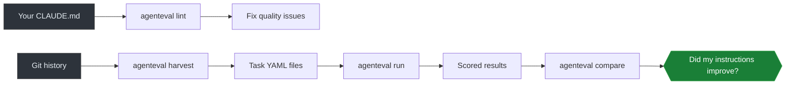

# agenteval

Your CLAUDE.md is untested. So is your AGENTS.md. agenteval fixes that -- it lints, benchmarks, and scores your AI coding instructions so you stop guessing and start measuring.

[](https://github.com/lukasmetzler/agenteval/actions/workflows/ci.yml)
[](https://github.com/lukasmetzler/agenteval/releases)
[](LICENSE)
[](https://www.typescriptlang.org/)
[](https://bun.sh)

## The Problem

Every team using AI coding tools writes instruction files. CLAUDE.md, AGENTS.md, .cursorrules, copilot-instructions.md -- whatever your tool calls them. You spend hours crafting these files, change a paragraph, and then... hope it works better. Maybe it does. Maybe you just broke something else. You have no way to know.

That is not engineering. That is vibes.

Your codebase has tests. Your APIs have contracts. Your AI instructions should have the same rigor.

## What agenteval Does



- **lint** catches wasted context budget, contradictions, dead references, and filler before an agent ever reads your instructions
- **harvest** turns your existing AI commits into replayable benchmarks -- no synthetic test cases needed
- **run** gives a task to an AI agent in a sandbox and scores the output against ground truth
- **compare** shows you exactly what improved (or regressed) when you changed your instructions
- **ci** gates your PRs -- instruction quality regressions fail the build
- **trends** tracks whether your team is getting better at writing instructions over time

## Quick Start

```bash
git clone https://github.com/lukasmetzler/agenteval.git
cd agenteval && bun install
bun run dev -- lint
```

You will see diagnostics like dead references, token bloat, and overlap between files. Follow the [Getting Started guide](docs/getting-started.md) for the full walkthrough.

## Demo

See the [`demo/`](demo/) directory for sample instruction files you can lint and test against. Run `agenteval lint -c demo/agenteval.yaml` to see agenteval catch real problems in realistic instruction files.

## Commands

| Command | What it does | Guide |
|---------|-------------|-------|
| `agenteval init` | Create starter agenteval.yaml config | [Configuration](docs/configuration.md) |
| `agenteval doctor` | Environment health check | [Getting Started](docs/getting-started.md) |
| `agenteval lint` | Static analysis of instruction files | [Linting](docs/lint.md) |
| `agenteval harvest` | Mine git history for eval task YAML | [Harvesting](docs/harvest.md) |
| `agenteval run` | Run an agent against a task and score it | [Running Evals](docs/run.md) |
| `agenteval results` | View and export stored eval results | [Results](docs/results.md) |
| `agenteval compare` | Compare two runs side by side | [Results](docs/results.md) |
| `agenteval trends` | Score history and trend analysis | [Trends](docs/trends.md) |
| `agenteval ci` | Run all harvested tasks, fail on regression | [CI Guide](docs/ci.md) |

## Documentation

| Guide | What it covers |
|-------|---------------|
| [Core Concepts](docs/concepts.md) | The 5 key ideas (instructions, tasks, assertions, harnesses, scoring) in plain English |
| [Getting Started](docs/getting-started.md) | Installation, first run, overview of all features |
| [Linting Guide](docs/lint.md) | All lint rules, output formats, CI integration, inline suppression |
| [Running Evals](docs/run.md) | Task definitions, harness adapters, scoring, the full eval pipeline |
| [Harvesting from Git History](docs/harvest.md) | AI commit detection, task generation, confidence tuning |
| [Results & Comparison](docs/results.md) | Viewing, filtering, exporting, and comparing eval runs |
| [Trends](docs/trends.md) | Score history and trend analysis across tasks |
| [CI Regression Detection](docs/ci.md) | Run tasks in CI, fail on quality regressions, threshold tuning |
| [Configuration Reference](docs/configuration.md) | Every config option with types, defaults, and examples |

## Installation

**From source** (requires [Bun](https://bun.sh) v1.3+):

```bash
git clone https://github.com/lukasmetzler/agenteval.git
cd agenteval && bun install && bun run build
./dist/agenteval --version
```

**From releases**: download the latest binary from [GitHub Releases](https://github.com/lukasmetzler/agenteval/releases) and place it on your PATH.

## Configuration

agenteval works with zero configuration. When you need to customize, create `agenteval.yaml`:

```yaml
version: 1
instructionGlobs: ["CLAUDE.md", "AGENTS.md"]
contextBudget: 0.3
```

See [Configuration Reference](docs/configuration.md) for the full schema.

## Who's Using This

Using agenteval? [Open a PR](https://github.com/lukasmetzler/agenteval/pulls) to add yourself here.

## Contributing

Contributions welcome. See the [contributing guidelines](CONTRIBUTING.md) for how to get started.

## License

MIT
