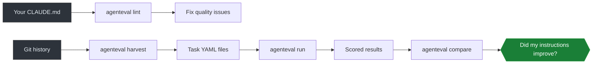

# agenteval

Your CLAUDE.md is untested. So is your AGENTS.md, your copilot-instructions.md, and your .cursorrules.

agenteval is a linter, benchmarker, and CI gate for AI coding instructions. It finds dead references, token bloat, contradictions, and stale instructions before your agent does. Then it scores agent performance so you can measure whether your instruction changes actually help.

[](https://github.com/lukasmetzler/agenteval/actions/workflows/ci.yml)
[](https://www.npmjs.com/package/agenteval-cli)
[](https://github.com/lukasmetzler/agenteval/releases)
[](LICENSE)


## Install

```bash
npm install -g agenteval-cli
```

Or pick your preferred method:

```bash
brew tap lukasmetzler/agenteval && brew install agenteval   # Homebrew
curl -fsSL https://raw.githubusercontent.com/lukasmetzler/agenteval/main/install.sh | bash  # Shell
```

No Bun, no Node at runtime. The binary is self-contained.

## Quick Start

```bash
agenteval lint                    # Find problems in your instruction files
agenteval lint --explain          # Same, with explanations for each rule
agenteval harvest --dry-run       # Preview what AI commits are in your history
agenteval ci                      # Run all tasks, fail on regressions
```

## What It Catches

- Dead references to files, paths, and headings that don't exist
- Filler phrases that waste context tokens ("make sure to", "it is important that")
- Contradictions between instruction files ("always use X" and "never use X")
- Content overlap and duplication across files
- Token budget overruns that crowd out code context
- Vague instructions without actionable specifics
- Stale instructions referencing code that was refactored weeks ago
- Invalid skill metadata (per Anthropic spec)
- Broken markdown links and heading anchors

## Supported Formats

| Format | Pattern |
|--------|---------|
| Claude Code | `CLAUDE.md` |
| OpenAI Codex / AGENTS | `AGENTS.md` |
| GitHub Copilot | `.github/copilot-instructions.md` |
| Scoped Copilot | `.github/instructions/*.instructions.md` |
| Anthropic Skills | `.claude/skills/*/SKILL.md` |
| Cursor | `.cursorrules`, `.cursor/rules/*.mdc` |

## Commands

| Command | What it does | Guide |
|---------|-------------|-------|
| `agenteval lint` | Static analysis of instruction files | [Linting](docs/lint.md) |
| `agenteval harvest` | Build eval tasks from AI commit history | [Harvesting](docs/harvest.md) |
| `agenteval harvest --live` | Score working tree changes before committing | [Harvesting](docs/harvest.md) |
| `agenteval run --task <file>` | Run an AI agent, score the result | [Running Evals](docs/run.md) |
| `agenteval compare <A> <B>` | Diff two runs side by side | [Results](docs/results.md) |
| `agenteval ci` | Run all tasks, gate on regressions | [CI Guide](docs/ci.md) |
| `agenteval trends` | Score history and trend analysis | [Trends](docs/trends.md) |
| `agenteval init` | Create a starter config | [Configuration](docs/configuration.md) |
| `agenteval update` | Self-update to the latest version | |
| `agenteval doctor` | Check environment health | |

## The Pipeline



Lint catches problems statically. Harvest builds benchmarks from your git history. Run scores agent performance. Compare tells you what changed. CI gates regressions before they merge.

## CI Integration

Add agenteval to your GitHub Actions workflow with one line:

```yaml
- uses: lukasmetzler/agenteval@v0
  with:
    command: ci                   # or: lint, harvest --dry-run
```

Or use the CLI directly in any CI system:

```bash
agenteval ci --min-score 0.7 --max-regression 0.05
```

See the [CI Guide](docs/ci.md) for thresholds, configuration, and examples.

## Installation Options

| Method | Command | Updates via |
|--------|---------|-------------|
| **npm** | `npm install -g agenteval-cli` | `npm update -g agenteval-cli` |
| **Homebrew** | `brew tap lukasmetzler/agenteval && brew install agenteval` | `brew upgrade agenteval` |
| **Shell** | `curl -fsSL https://raw.githubusercontent.com/lukasmetzler/agenteval/main/install.sh \| bash` | `agenteval update` |
| **GitHub Action** | `uses: lukasmetzler/agenteval@v0` | Always latest |
| **Binary** | [GitHub Releases](https://github.com/lukasmetzler/agenteval/releases) | `agenteval update` |
| **Source** | `git clone ... && bun install && bun run build` | `git pull && bun run build` |

## Documentation

| Guide | What it covers |
|-------|---------------|
| [Core Concepts](docs/concepts.md) | Instructions, tasks, assertions, harnesses, scoring |
| [Getting Started](docs/getting-started.md) | Installation, first run, full walkthrough |
| [Linting](docs/lint.md) | All lint rules, output formats, CI integration |
| [Running Evals](docs/run.md) | Task definitions, harness adapters, scoring pipeline |
| [Harvesting](docs/harvest.md) | AI commit detection, task generation, live review |
| [CI Guide](docs/ci.md) | Regression detection, thresholds, GitHub Actions example |
| [Trends](docs/trends.md) | Score history and trend analysis |
| [Configuration](docs/configuration.md) | Every config option with types and defaults |

## Contributing

See [CONTRIBUTING.md](CONTRIBUTING.md).

## License

MIT
