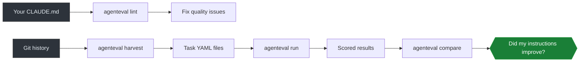

# agenteval

Your CLAUDE.md is untested. So is your AGENTS.md, your copilot-instructions.md, and your .cursorrules. agenteval is a linter, benchmarker, and CI gate for AI coding instructions. Stop hoping your instructions work. Measure it.

[](https://github.com/lukasmetzler/agenteval/actions/workflows/ci.yml)
[](https://github.com/lukasmetzler/agenteval/releases)
[](LICENSE)
[](https://www.typescriptlang.org/)
[](https://bun.sh)


## Get Started in 10 Seconds

```bash
curl -fsSL https://raw.githubusercontent.com/lukasmetzler/agenteval/main/install.sh | bash
```

Then lint your instruction files:

```bash
agenteval lint
```

No Bun, no Node, no runtime. The binary is self-contained.

## Why This Exists

Your codebase has tests. Your APIs have contracts. Your AI instructions have... hope.

Every team using AI coding tools writes instruction files. You change a paragraph, push it, and cross your fingers. Maybe the agent performs better. Maybe you just broke something. You have no way to know.

agenteval gives you that way. Lint catches problems statically. Harvest builds benchmarks from your git history. Run scores agent performance. Compare tells you if your changes helped. CI gates regressions before they merge.



## What It Catches

- Dead references to files that don't exist
- Filler phrases that waste context tokens ("make sure to", "it is important that")
- Contradictions ("always use X" and "never use X" in the same file)
- Content overlap between instruction files
- Token budget overruns that crowd out code context
- Vague instructions without specifics ("be careful", "write good code")
- Broken markdown links and heading anchors
- Invalid skill metadata (per Anthropic spec)

## Commands

| Command | What it does |
|---------|-------------|
| `agenteval lint` | Find quality issues in instruction files ([guide](docs/lint.md)) |
| `agenteval lint --explain` | Same, but shows why each rule matters |
| `agenteval harvest` | Build eval tasks from your AI commit history ([guide](docs/harvest.md)) |
| `agenteval harvest --live` | Score your working tree changes before committing |
| `agenteval run --task <file>` | Run an AI agent against a task, score the result ([guide](docs/run.md)) |
| `agenteval compare <A> <B>` | Compare two runs side by side ([guide](docs/results.md)) |
| `agenteval ci` | Run all tasks, fail on regressions ([guide](docs/ci.md)) |
| `agenteval trends` | Score history and trend analysis ([guide](docs/trends.md)) |
| `agenteval init` | Create a starter config ([guide](docs/configuration.md)) |
| `agenteval doctor` | Check environment health |

## Supports Every Instruction Format

- `CLAUDE.md` (Claude Code)
- `AGENTS.md` (OpenAI Codex, generic agents)
- `.github/copilot-instructions.md` (GitHub Copilot)
- `.github/instructions/*.instructions.md` (scoped Copilot instructions)
- `.claude/skills/*/SKILL.md` (Anthropic skills)
- `.cursorrules` and `.cursor/rules/*.mdc` (Cursor)

Try it on the included [demo files](demo/) that cover all formats.

## Documentation

| Guide | What it covers |
|-------|---------------|
| [Core Concepts](docs/concepts.md) | Instructions, tasks, assertions, harnesses, scoring |
| [Getting Started](docs/getting-started.md) | Installation, first run, full walkthrough |
| [Linting](docs/lint.md) | All lint rules, output formats, CI integration |
| [Running Evals](docs/run.md) | Task definitions, harness adapters, scoring pipeline |
| [Harvesting](docs/harvest.md) | AI commit detection, task generation, live review |
| [CI Guide](docs/ci.md) | Regression detection, thresholds, GitHub Actions example |
| [Configuration](docs/configuration.md) | Every config option with types and defaults |

## Installation

**Quick install** (Linux, macOS):
```bash
curl -fsSL https://raw.githubusercontent.com/lukasmetzler/agenteval/main/install.sh | bash
```

**Download binary** from [GitHub Releases](https://github.com/lukasmetzler/agenteval/releases).

**Build from source** (requires [Bun](https://bun.sh) v1.3+):
```bash
git clone https://github.com/lukasmetzler/agenteval.git && cd agenteval && bun install && bun run build
```

## Contributing

See [CONTRIBUTING.md](CONTRIBUTING.md).

## License

MIT
