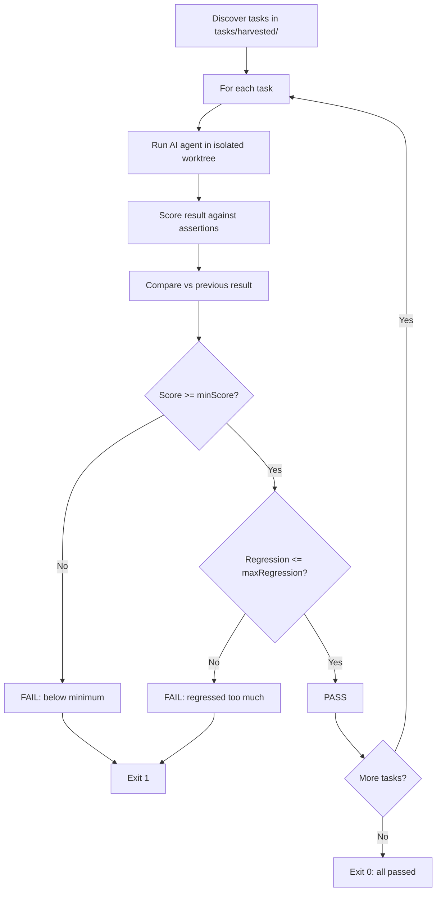

# CI Regression Detection

## Overview

The `ci` command runs all your harvested eval tasks, scores each one, and fails the build if any score drops below a threshold or regresses compared to the previous run. Use it in GitHub Actions, GitLab CI, or any pipeline to catch instruction quality regressions before they merge.

## Quick Start

```bash
# 1. Generate eval tasks from your git history (one-time setup)
agenteval harvest

# 2. Run CI locally to test
agenteval ci

# 3. Add to your GitHub Actions workflow
```

```yaml
# .github/workflows/eval.yml
name: Instruction Quality
on: [pull_request]
jobs:
  eval:
    runs-on: ubuntu-latest
    steps:
      - uses: actions/checkout@v4
        with:
          fetch-depth: 0
      - uses: oven-sh/setup-bun@v2
      - run: bun install --frozen-lockfile
      - run: bun run build
      - run: ./agenteval ci
```

## Command Reference

```
agenteval ci [options]
```

| Option | Type | Default | Description |
|--------|------|---------|-------------|
| `--tasks-dir <dir>` | string | `tasks/harvested` | Directory with task YAML files |
| `--min-score <n>` | float | `0.5` | Minimum acceptable overall score (0-1) |
| `--max-regression <n>` | float | `0.1` | Max allowed score drop vs previous run (0-1) |
| `--instructions <path>` | string | `CLAUDE.md` | Instruction file to evaluate |
| `--harness <name>` | string | `auto` | Override harness for all tasks |
| `-c, --config <path>` | string | auto-discover | Path to agenteval.yaml |

## How It Works



## Threshold Strategy

CI uses two independent checks for each task:

**Absolute minimum** (`--min-score`): The score must be at least this high. Default 0.5. Tasks scoring below this always fail regardless of history.

**Relative regression** (`--max-regression`): The score can't drop more than this amount compared to the previous run. Default 0.1 (10% drop). A task that scored 0.80 last time fails if it drops below 0.70.

Both thresholds are checked. A task fails if it violates either one.

### Tuning

```bash
# Strict: fail on any score below 0.7 or any drop > 5%
agenteval ci --min-score 0.7 --max-regression 0.05

# Lenient: only fail on very low scores or major regressions
agenteval ci --min-score 0.3 --max-regression 0.2

# Absolute only: ignore regressions, just enforce a floor
agenteval ci --min-score 0.6 --max-regression 1.0
```

## Configuration

Default CI settings in `agenteval.yaml`:

```yaml
ci:
  tasksDir: "tasks/harvested"
  minScore: 0.5
  maxRegression: 0.1
  instructions: "CLAUDE.md"
```

CLI flags override config values.

## Output

### All passing

```
  agenteval ci
  ────────────

  Tasks              12
  Instructions       CLAUDE.md
  Min score          0.5
  Max regression     0.1

  [1/12] harvest-abc123  0.85  +0.03  ✓
  [2/12] harvest-def456  0.91  +0.00  ✓
  ...
  ──────────────────────────────────────
  12 tasks · 12 passed · 0 failed · 42.3s

  CI PASSED
```

### With failures

```
  [12/12] harvest-789bcd  0.60  -0.18  ✗

  ──────────────────────────────────────
  12 tasks · 11 passed · 1 failed · 42.3s

  Failures:
    ✗ harvest-789bcd  0.60 — regressed 0.18 (max: 0.10)

  CI FAILED
```

## Exit Codes

| Code | Meaning |
|------|---------|
| 0 | All tasks passed |
| 1 | One or more tasks failed (regression or below minimum) |
| 2 | Configuration or runtime error (no tasks, invalid config) |

## Tips

- **Start with loose thresholds** (`--min-score 0.3`) and tighten over time as your instructions improve.
- **Run `agenteval harvest` periodically** to add new tasks from recent AI commits.
- **Use `agenteval ci --tasks-dir tasks/curated/`** with hand-picked tasks for a focused benchmark suite.
- **Check `agenteval results`** after a CI failure to see full details of each run.
- **First run has no baseline** — tasks show "new" instead of a delta. They pass if above `minScore`.
