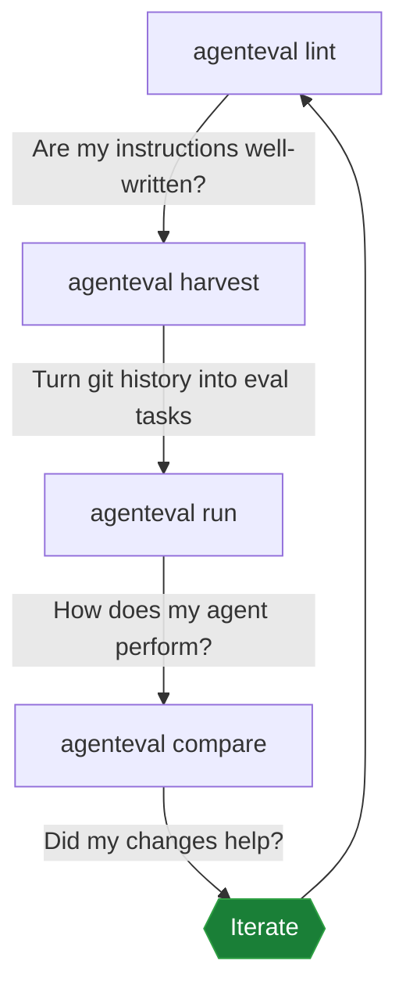

# Core Concepts

## What agenteval Does

You write instruction files for AI coding tools -- CLAUDE.md, AGENTS.md, .cursorrules -- that tell agents how to write code in your project. agenteval measures whether those instructions actually work by running controlled evals and scoring the results. Change your instructions, re-run the evals, and see if the scores improve.

## The Five Concepts

### 1. Instruction Files

Instruction files are the files that tell AI coding tools how to write code in your project: CLAUDE.md for Claude Code, AGENTS.md for OpenCode, .cursorrules for Cursor, copilot-instructions.md for GitHub Copilot. Think of them as a style guide for your AI pair programmer.

agenteval lints these files for quality problems (bloat, broken references, contradictions) and uses them as the variable in your evals. The core question is always: "does changing this instruction file make the agent perform better or worse?"

### 2. Tasks

A task is a coding challenge you give to an AI agent. Tasks are defined in YAML files with a prompt ("fix the null pointer in the parser"), a timeout, and expected outcomes. You can write tasks by hand or generate them automatically from your git history using the `harvest` command.

```yaml
name: fix-null-pointer
prompt: "Fix the null pointer exception in src/parser.ts"
timeout: 120
assertions:
	- type: files-changed
	  pattern: "src/parser.ts"
	- type: test-pass
	  command: "bun test"
```

### 3. Assertions

Assertions are the expected outcomes of a task -- the "how do I know if the agent did the right thing?" part. After the agent finishes, agenteval checks each assertion and records pass or fail. There are five types:

| Type | What it checks |
|------|---------------|
| `files-changed` | The agent modified files matching a glob pattern |
| `files-unchanged` | The agent did not touch files matching a pattern |
| `test-pass` | A shell command exits with code 0 |
| `no-new-warnings` | A linter or type checker still passes |
| `convention` | A regex pattern is present (or absent) in the diff |

### 4. Harnesses

A harness is the adapter between agenteval and your AI coding tool. agenteval does not call AI APIs directly -- it spawns your locally installed tool (Claude Code, Copilot, etc.) as a subprocess. The harness handles checking that the tool is installed, injecting your instruction files, running the agent, and parsing token usage from the output.

Built-in harnesses: `claude-code`, `copilot`, `opencode`, `generic` (any CLI tool), `mock` (for testing). Set `auto` to let agenteval pick based on which instruction files exist in your project.

### 5. Scoring

Every eval run produces scores across four dimensions, each from 0 to 1:

| Dimension | What it measures |
|-----------|-----------------|
| **correctness** | Did the agent produce the right change? (assertion pass rate) |
| **precision** | Did it only change what needed changing? (no unrelated edits) |
| **efficiency** | How many tokens did it use relative to the budget? |
| **conventions** | Did it follow the project's coding conventions? |

These combine into a weighted overall score. Default weights are 0.4 / 0.3 / 0.2 / 0.1, but you can tune them per task. If a dimension has no data (e.g., no convention assertions), its weight is redistributed to the others.

## The Workflow



**lint** -- Run this first. Catches bloated files, broken references, and contradictions before you waste time on evals. Works in CI.

**harvest** -- Scans your git history for AI-assisted commits and generates task YAML from them. Gives you a ready-made benchmark suite from real work.

**run** -- Executes a task in an isolated git worktree, scores the result, and saves it. This is the core eval loop.

**compare** -- Shows a side-by-side score comparison of two runs. This is how you know whether an instruction change helped or hurt.

## What's Next

Read the [Getting Started](getting-started.md) guide for a hands-on walkthrough that takes you from installation to a scored eval run in 5 minutes.
